# VProfile Multi-Tier Web Stack (Manual Provisioning)

## Project Overview

This project documents the manual deployment of the VProfile multi-tier application in a local virtualized environment. Five VMs are provisioned to isolate each service tier, highlighting service dependencies, configuration flow, and end-to-end deployment.

## Architecture & Technology Stack

The system follows a classic multi-tier architecture where each service is isolated for scalability and security.

- **Virtualization & Orchestration:** Oracle VM VirtualBox and Vagrant.
- **Web Tier:** Nginx acting as a web server and reverse proxy.
- **Application Tier:** Apache Tomcat serving the Java application.
- **Messaging/Brokerage:** RabbitMQ for queuing and broker services.
- **Caching Layer:** Memcached for database caching.
- **Database Tier:** MySQL/MariaDB for relational data storage.

### Architecture Diagram

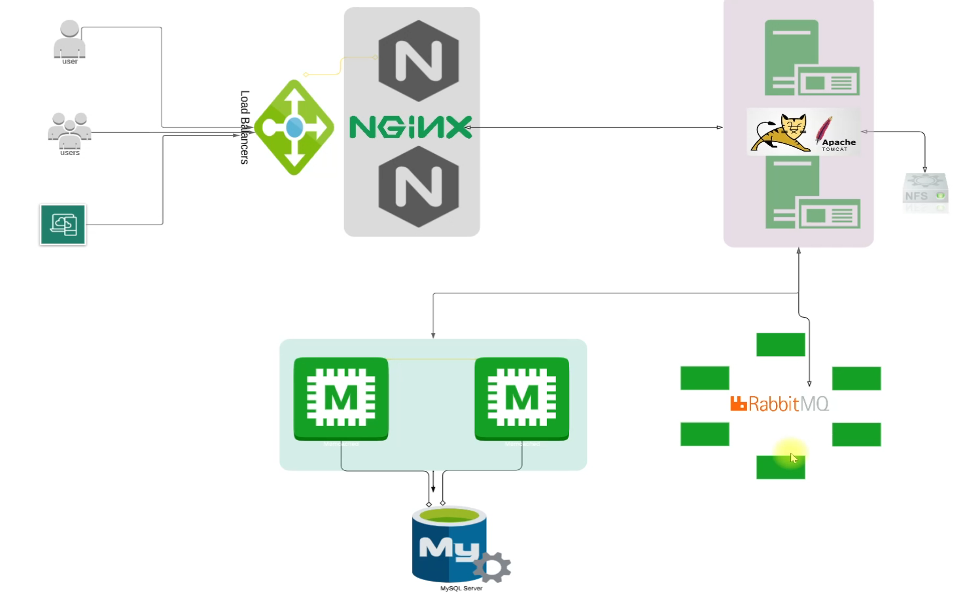

## Implementation Roadmap

The deployment order follows service dependencies so that backend services are ready before the application tier connects.

### 1) Environment Setup

Configured the vagrant-hostmanager plugin to enable VM-to-VM name resolution via hostnames instead of static IPs.

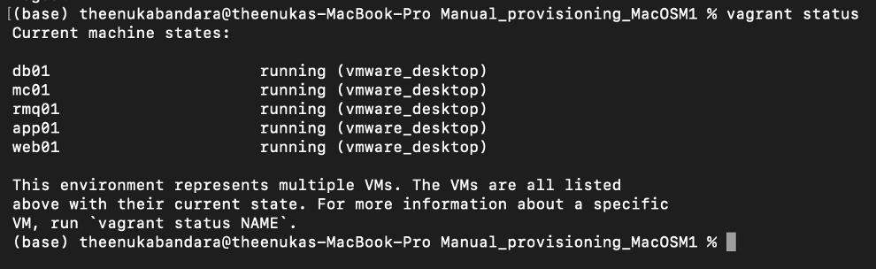

### 2) Database Provisioning (MariaDB)

Initialized the accounts database, verified schema load, and ensured port 3306 access.

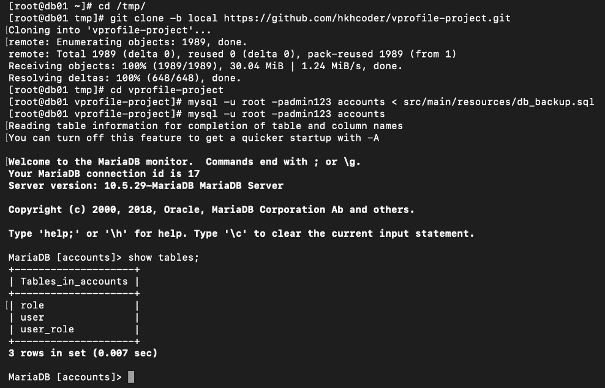

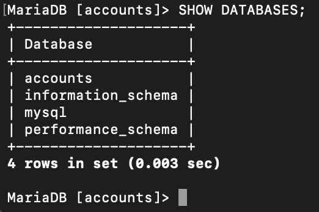

### 3) Cache and Messaging

Configured Memcached to listen on port 11211 and validated the service startup.

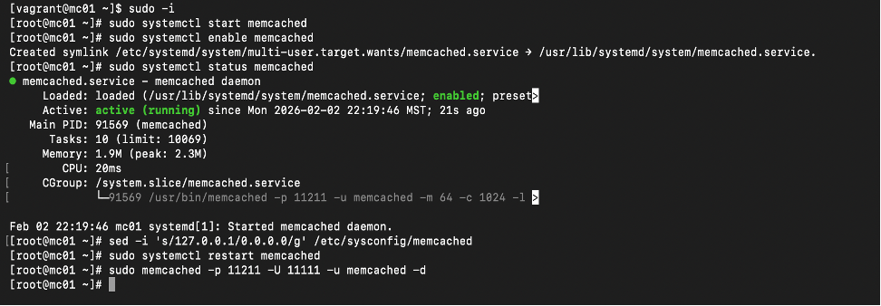

Provisioned RabbitMQ with a dedicated administrative user and validated service status.

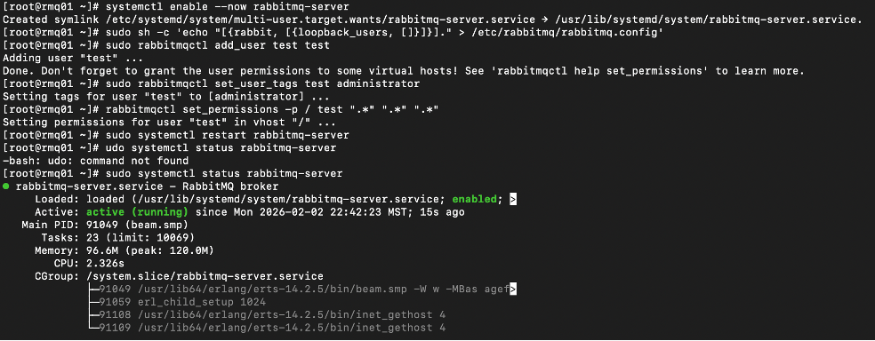

### 4) Application Server (Tomcat)

Installed Java 17 and Tomcat 10 on app01 and validated the Tomcat service.

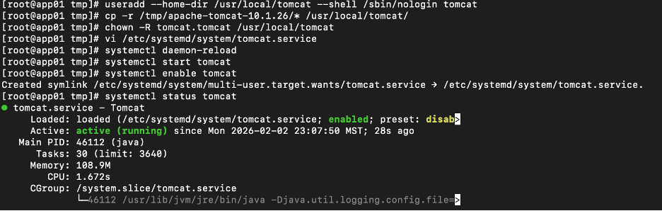

### 5) Build and Deployment (Maven)

Built the application from source using Maven and deployed the generated .war into Tomcat.

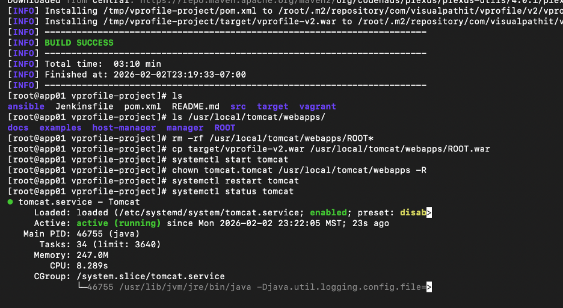

### 6) Web Proxy Configuration (Nginx)

Configured Nginx on web01 as a reverse proxy and verified the service status.

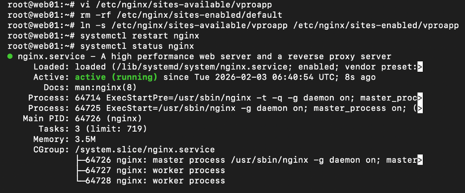

## Application Screenshots

### Login Page

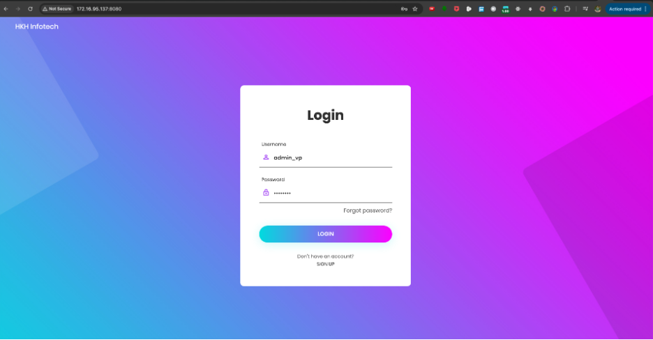

### User Dashboard

### Users List

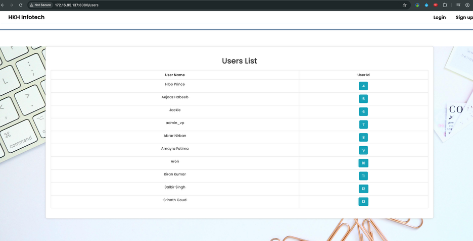

### User Details (DB + Cache)

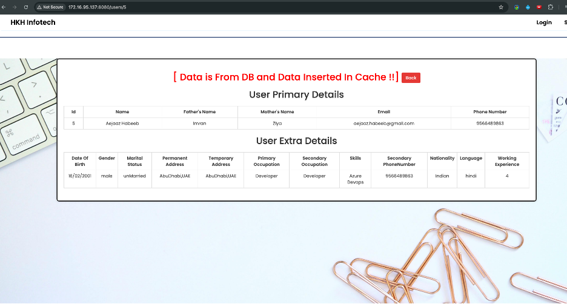

### RabbitMQ Integration

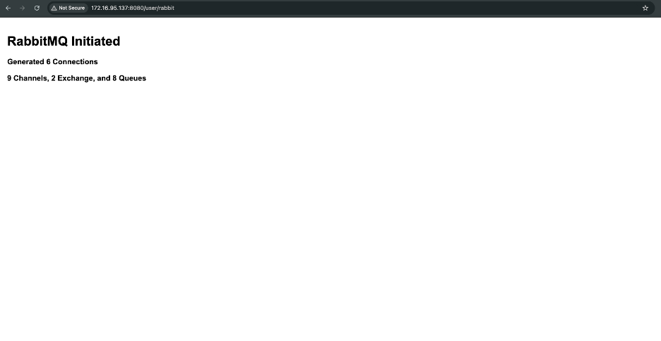

## Key Technical Competencies Demonstrated

- **Linux Administration:** Package management, service control, and permissions.
- **Network Security:** Host-based firewall rules to secure service ports.
- **Infrastructure as Code (Intro):** Reproducible VM provisioning with Vagrant.
